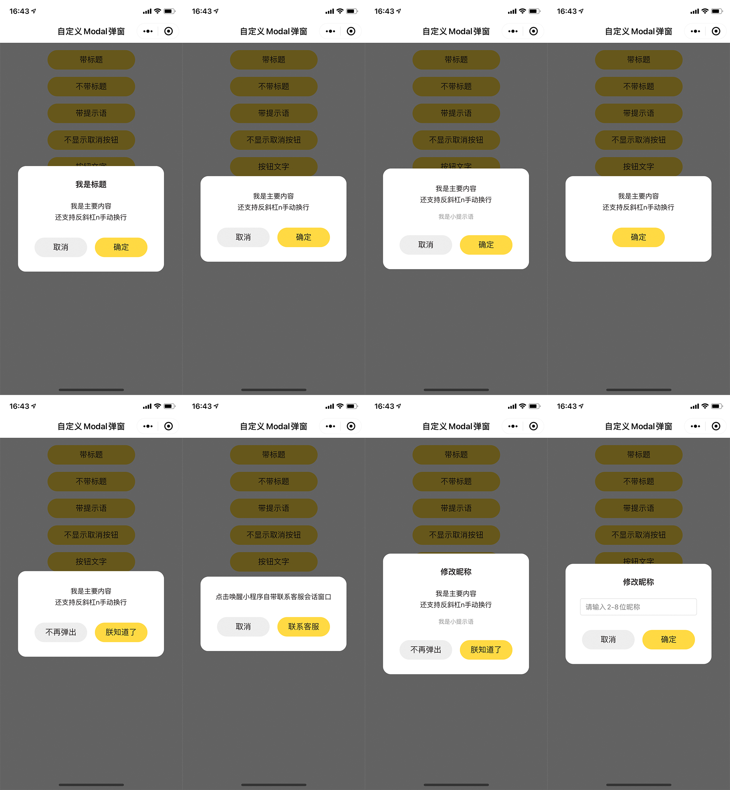

# 微信小程序自定义弹窗

#### 介绍

微信小程序自定义弹窗，日常项目中写的，顺便开源，也方便自己复制粘贴
第一版，有机会慢慢完善


#### 效果图




#### 使用教程

1. 复制粘贴 component/modal 文件夹
2. app.json 中：

   ```json
   "usingComponents": {
     "diy-modal": "/component/modal/index"
   }
   ```

3. app.js 中：

   ```javascript
   import diyModal from './component/modal/modal';
   App({
     diyModal: diyModal,
   });
   ```

4. page.wxml 中：

   ```html
   <diy-modal id="diy-modal"></diy-modal>
   ```

5. page.js 中：

   ```javascript
   const app = getApp();
   app.diyModal.show({
     title: '标题',
     content: '内容',
     tip: '内容下灰色的提示小字',
     showCancel: false,
     cancelText: '取消',
     confirmText: '确定',
     confirm(e) {
       //点击确定
     },
     cancel() {
       //点击取消
     },
   });
   
   // 主动隐藏弹窗
   app.diyModal.hide()
   ```
